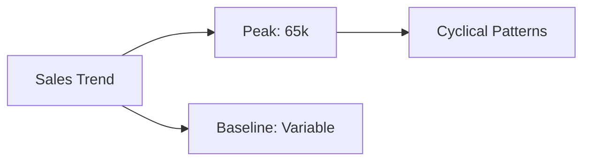
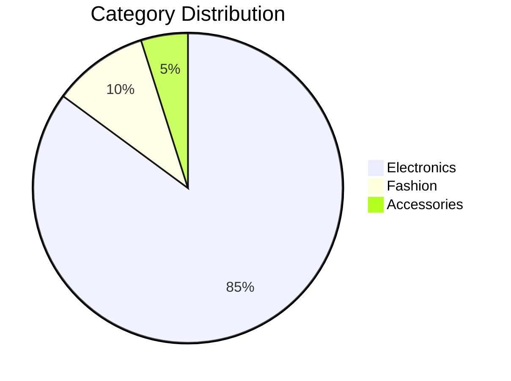

# RetailPulse Analytics Dashboard

## Overview
The RetailPulse Analytics Dashboard provides comprehensive insights into retail operations, sales performance, and profit analysis across multiple cities and product categories.

---

## Dashboard Views

### 1. Executive Summary & Key Metrics

**KPI Cards:**
- **Total Revenue**: $1.38M - Total cumulative revenue across all sales
- **Total Profit**: $244.7K - Overall profit generated from sales operations
- **Total Orders**: 70 - Total number of orders processed
- **Avg Revenue**: $19.72K - Average revenue per order

These metrics provide an at-a-glance view of business health and performance indicators.

---

### 2. Sales Trend Analysis

The Sales Trend chart displays revenue patterns over time with two trend lines:
- **Upper trend line**: Represents peak sales periods with fluctuations ranging from 0k to 65k
- **Lower trend line**: Shows baseline sales performance

**Key Insights:**
- Cyclical sales patterns visible with regular peaks and troughs
- Helps identify seasonal trends and sales cycles
- Enables better inventory and resource planning

---

### 3. City-wise Sales Performance

| City | Revenue | Performance |
|------|---------|-------------|
| Mumbai | $300k | Highest |
| Pune | $350k | Strong |
| Bangalore | $350k | Consistent |
| Delhi | $200k | Growth Opportunity |

This breakdown helps identify geographical performance and regional strengths.

---

### 4. Category Distribution

Electronics clearly dominates the product portfolio, driving the majority of revenue.

---

### 5. Revenue vs Profit Analysis

| Category | Revenue | Profit | Margin |
|----------|---------|--------|--------|
| Electronics | $1.2M | $180k | 15% |
| Fashion | $150k | $30k | 20% |
| Accessories | $30k | $4.7k | 16% |

This analysis reveals which product categories deliver the best profitability relative to sales volume.

---

### 6. Profit Distribution by City and Category

**Mumbai**
- Electronics: Primary revenue driver
- Fashion: Secondary contributor

**Pune**
- Electronics: Dominant
- Fashion: Supporting category

**Bangalore**
- Electronics: Main profit source
- Accessories: Growing segment

**Delhi**
- Electronics: Core business
- Fashion: Emerging opportunity

---

### 7. Interactive Filters & Detailed Analysis

**Filter Options:**
- **City**: Select specific cities for targeted analysis
- **Category**: Filter by product category (Accessories, Electronics, Fashion)
- **Date**: Time-based filtering for temporal analysis

**Customer Type Chart**
- **Premium Customers**: ~800k revenue (highest value segment)
- **Regular Customers**: ~600k revenue (volume segment)

**Top 5 Products by Revenue**

| Rank | Product | Revenue | Status |
|------|---------|---------|--------|
| 1 | Laptop | ~700k | Market Leader |
| 2 | Mobile | ~350k | Strong Performer |
| 3 | Tablet | ~200k | Growing |
| 4 | Shoes | ~150k | Steady |
| 5 | Others | ~100k | Emerging |

---

## Dashboard Features

✅ **Real-time KPI Tracking** - Monitor key performance indicators instantly
✅ **Multi-dimensional Analysis** - City, Category, and Customer Type perspectives
✅ **Interactive Filtering** - Drill down into specific segments
✅ **Trend Analysis** - Identify patterns and seasonal variations
✅ **Profit Optimization** - Understand which products and regions are most profitable
✅ **Geographic Intelligence** - Compare performance across cities

---

## How to Use

1. **Quick Overview**: Start with the KPI cards to understand overall business performance
2. **Trend Analysis**: Review the Sales Trend chart for temporal patterns
3. **Geographic Analysis**: Use City-wise Sales to identify strong and weak regions
4. **Category Deep Dive**: Examine Category Distribution and Revenue vs Profit Analysis
5. **Detailed Filtering**: Use the interactive filters to focus on specific segments
6. **Product Analysis**: Review Top 5 Products for inventory and marketing decisions

---

## Key Takeaways

- **Electronics dominance**: 85%+ of revenue comes from electronics
- **Geographic variation**: Mumbai and Pune outperform other regions
- **Premium segment**: Premium customers generate higher average revenue
- **Product focus**: Laptop is the top revenue generator
- **Growth opportunities**: Delhi and fashion category show growth potential

---

## Contact & Support

For questions or to request additional analytics, please contact the Analytics Team.

Last Updated: July 2026
